# Agent Fleet Architecture

## 1. Executive Summary

The **ITEP (IT Engineering Productivity) Agentic AI Platform** is Cisco's solution for enhancing software development productivity through semi and fully autonomous AI agents. The platform provides AI-friendly APIs (A2A protocol, MCP servers) accessible to multiple clients including Circuit (a ChatGPT-like UI), IDEs, and bots.

The **Router Agent** acts as an entry point to the ITEP platform, an intelligent orchestrator that:
- Receives complex user requests and breaks them into actionable tasks
- Discovers and coordinates specialized agents (e.g., Coda, AskCody, Golden pathways, etc.)
- Aggregates and summarizes results for users

The Router Agent uses a **capability-driven architecture**: it reads agent capabilities from their agent cards and dynamically assigns tasks based on what each agent can do, rather than hardcoding assumptions about agent boundaries.

**Key Benefits:**
- **Flexible orchestration**: Adapts to new agents without code changes
- **Transparent progress**: Streams status updates to users
- **Dynamic re-planning**: Adjusts execution based on intermediate results

## 2. System Context

The ITEP Agentic AI Platform serves Cisco IT workers (developers, DevOps engineers, etc.) and integrates with Cisco's software engineering ecosystem.

### C4 System Context Diagram

```plantuml
@startuml
!include https://raw.githubusercontent.com/plantuml-stdlib/C4-PlantUML/master/C4_Context.puml
SHOW_PERSON_OUTLINE()

title System Context - ITEP Agentic AI Platform

Person(users, "Cisco IT Personnel", "Developers, DevOps engineers, product managers")

System(itep, "ITEP Agentic AI Platform", "Intelligent orchestration platform for AI agents using A2A protocol")

System_Ext(bots, "Chat Bots", "Slack/WebEx bots for conversational access")
System_Ext(circuit, "Circuit", "ChatGPT-like UI for task submission (future A2A support)")
System_Ext(ides, "IDEs", "IDE extensions for in-editor assistance")
Lay_R(bots, circuit)
Lay_R(ides, bots)

System_Ext(github, "GitHub", "Code repository and version control")
System_Ext(jira, "JIRA", "Issue tracking and project management")
System_Ext(jenkins, "Jenkins", "CI/CD orchestration and build automation")
System_Ext(sonarqube, "SonarQube", "Code quality and security scanning")
System_Ext(splunk, "Splunk", "Logging and monitoring")
System_Ext(other, "Other", "Other extennal systems")

Rel(users, circuit, "Submits tasks via", "HTTPS")
Rel(users, ides, "Uses", "")
Rel(users, bots, "Chats with", "WebEx/Slack")

Rel(circuit, itep, "Sends requests to", "A2A Protocol (future)")
Rel(ides, itep, "Invokes agents via", "A2A/MCP")
Rel(bots, itep, "Delegates tasks to", "A2A Protocol")

Rel(itep, github, "Accesses code", "Git/REST API")
Rel(itep, jira, "Manages tickets", "REST API")
Rel(itep, jenkins, "Triggers builds, fetches logs", "REST API")
Rel(itep, sonarqube, "Queries violations", "REST API")
Rel(itep, splunk, "Logs, traces", "REST API")
Rel(itep, other, "TBC", "TBC")

note right of itep
  **ITEP Platform:**
  - Router Agent (orchestrator)
  - Specialized agents (Coda, AskCody, etc.)
  - A2A protocol for inter-agent communication
  - MCP protocol for tools
  - Capability-driven task assignment
end note

note right of circuit
  **Client Access:**
  - Circuit: UI (future A2A)
  - IDEs: Direct integration
  - Bots: Conversational interface
end note

@enduml
```

### System Context Description

**Users:**
- Cisco IT personnel including developers, DevOps engineers, product managers, etc.
- Access ITEP via multiple clients (Circuit UI, IDE extensions, chatbots)

**ITEP Platform:**
- Central orchestration layer for ITEP AI agents
- Exposes A2A protocol endpoints for agent-to-agent communication
- Manages agent discovery, task assignment, and execution coordination

**Client Systems:**
- **Circuit**: ChatGPT-like web UI (planned A2A support)
- **IDEs**: Editor extensions for in-context assistance
- **Bots**: Slack/WebEx integrations for conversational workflows

**External Systems:**
- **GitHub**: Source code repository
- **JIRA**: Issue and ticket tracking
- **Jenkins**: CI/CD pipelines and build logs
- **SonarQube**: Code quality analysis
- **Splunk**: Log aggregation and monitoring

## 3. Container Architecture

The ITEP platform runs on a LangGraph server cluster (managed or self-hosted) and consists of several containers working together.

### C4 Container Diagram

```plantuml
@startuml
!include https://raw.githubusercontent.com/plantuml-stdlib/C4-PlantUML/master/C4_Container.puml
SHOW_PERSON_OUTLINE()

title Container Diagram - ITEP Agentic AI Platform

Person(users, "Cisco IT Workers", "Submit requests via clients")

System_Boundary(itep, "ITEP Agentic AI Platform") {

    Container(router, "Router Agent", "LangGraph Agent", "Orchestrates multi-agent execution, breaks down tasks, aggregates results")

    Container(coda, "Coda Agent", "LangGraph Agent", "Remediates SonarQube violations (accesses SonarQube, Git, Jenkins, JIRA)")

    Container(askcody, "AskCody Agent", "LangGraph Agent", "Diagnoses CI/CD issues (accesses Git, Jenkins, build logs)")

    Container(other_agents, "Other Agents", "LangGraph Agents", "Additional specialized agents discovered dynamically")

    ContainerDb(langgraph_api, "LangGraph API", "REST API", "Provides /assistants/search, /a2a endpoints for agent discovery and communication")

    Container(auth, "Auth Service", "Service", "Validates tokens, manages authorization")

    Container(monitoring, "Monitoring", "Service", "Platform observability and logging")
}

System_Ext(circuit, "Circuit UI", "Web application")
System_Ext(github, "GitHub", "Code repository")
System_Ext(jenkins, "Jenkins", "CI/CD")
System_Ext(sonarqube, "SonarQube", "Code quality")

Rel(users, circuit, "Uses", "HTTPS")
Rel(circuit, auth, "Authenticates", "HTTPS")
Rel(circuit, router, "Submits tasks", "A2A Protocol (future)")

Rel(router, langgraph_api, "Discovers agents", "GET /assistants/search")
Rel(router, langgraph_api, "Fetches agent cards", "GET /a2a/{id}/card")
Rel(router, coda, "Delegates SonarQube tasks", "POST /a2a/{id} (JSON-RPC)")
Rel(router, askcody, "Delegates CI/CD tasks", "POST /a2a/{id} (JSON-RPC)")
Rel(router, other_agents, "Delegates tasks", "POST /a2a/{id} (JSON-RPC)")

Rel(coda, sonarqube, "Queries violations", "REST API")
Rel(coda, github, "Creates PRs, commits fixes", "Git/REST")
Rel(coda, jenkins, "Triggers builds", "REST API")

Rel(askcody, jenkins, "Fetches build logs", "REST API")
Rel(askcody, github, "Analyzes commits", "Git/REST")

Rel(monitoring, router, "Collects metrics", "")
Rel(monitoring, coda, "Collects metrics", "")
Rel(monitoring, askcody, "Collects metrics", "")

note right of router
  **Router Agent:**
  - Entry point to agent fleet
  - Capability-driven orchestration
  - Parallel task execution
  - Result aggregation
end note

note bottom of langgraph_api
  **LangGraph Cluster:**
  All agents run on same
  LangGraph server cluster
  (managed or self-hosted)
end note

@enduml
```

### Container Architecture Description

**Router Agent:**
- Entry point for all user requests
- Discovers available agents via LangGraph API
- Breaks down complex tasks based on agent capabilities
- Orchestrates parallel execution
- Aggregates and summarizes results

**Specialized Agents:**
- **Coda**: Remediates SonarQube code violations (accesses SonarQube, Git, Jenkins, JIRA)
- **AskCody**: Diagnoses CI/CD build failures (accesses Jenkins, Git, build logs)
- **Other Agents**: Dynamically discovered agents with specific capabilities

**Platform Services:**
- **LangGraph API**: Provides agent discovery (`/assistants/search`) and A2A communication endpoints
- **Auth Service**: Validates authentication tokens from clients
- **Monitoring**: Observability, logging, and metrics collection

**Deployment:**
- All agents run on the same LangGraph server cluster
- Cluster can be either LangSmith-managed or self-hosted (decision pending, leaning toward managed)

**Communication:**
- All inter-agent communication uses A2A protocol (JSON-RPC over HTTP)
- Agents declare capabilities via agent cards
- Router uses capabilities for dynamic task assignment

## 4. Router Agent Design

The Router Agent is the orchestration engine of the ITEP platform. This section details its internal components.

### C4 Component Diagram

```plantuml
@startuml
!include https://raw.githubusercontent.com/plantuml-stdlib/C4-PlantUML/master/C4_Component.puml
SHOW_PERSON_OUTLINE()

title Component Diagram - Router Agent Internal Architecture

Person(user, "User", "Submits requests to the agent fleet")

System_Boundary(langgraph, "LangGraph Server Platform") {

    Container_Boundary(router_container, "Router Agent") {
        Component(guardrails, "Guardrails", "Component", "Validates requests are on-topic using built-in LLM")
        Component(task_breakdown, "Task Breakdown", "Component", "Analyzes complexity and breaks requests into sub-tasks based on agent capabilities")
        Component(orchestrator, "Orchestrator", "Component", "Dispatches tasks to agents, monitors execution, handles parallel execution")
        Component(summarizer, "Summarizer", "Component", "Aggregates results from all agents (only task Router executes)")
        Component(registry, "Agent Registry", "Component", "Discovers agents via LangGraph API, caches agent cards and capabilities")

        Rel(guardrails, task_breakdown, "Routes valid requests to")
        Rel(task_breakdown, registry, "Reads agent capabilities from")
        Rel(task_breakdown, orchestrator, "Sends plan to")
        Rel(orchestrator, registry, "Queries agent details from")
        Rel(orchestrator, summarizer, "Sends results to")
    }

    Container(other, "Other Agents", "A2A Agents", "Specialized agents (e.g., Coda, AskCody) discovered dynamically via LangGraph API")

    ComponentDb(langgraph_api, "LangGraph API", "REST API", "Provides /assistants/search and /a2a endpoints")
}

Rel(user, guardrails, "Submits request", "HTTP/A2A")
Rel(user, orchestrator, "Receives status updates", "Streaming")
Rel(summarizer, user, "Returns final response", "HTTP/A2A")

Rel(registry, langgraph_api, "Discovers agents", "GET /assistants/search")
Rel(registry, other, "Fetches agent cards", "GET /a2a/{id}/card")

Rel(orchestrator, other, "Dispatches tasks", "POST /a2a/{id} (JSON-RPC)")

Rel(other, orchestrator, "Returns results", "A2A Response")

note right of router_container
  **Router Components:**
  - Guardrails: Built-in validation
  - Task Breakdown: Capability-driven decomposition
  - Orchestrator: Parallel execution, re-planning
  - Summarizer: Only self-executed task
  - Registry: Capability-driven discovery
end note

note right of langgraph_api
  **A2A Protocol:**
  - Discovery via /assistants/search
  - Capabilities via /a2a/{id}/card
  - Execution via POST /a2a/{id}
  - Standardized JSON-RPC format
end note

note left of other
  **External Agents:**
  Declare capabilities in agent cards
  Router uses capabilities to:
  - Determine task granularity
  - Assign tasks appropriately
  - No hardcoded assumptions
end note

@enduml
```

### Component Details

**Guardrails:**
- **Responsibility**: Validate that incoming requests are on-topic for ITEP platform
- **Implementation**: Built-in LLM-based classification (Phase 1)
- **Future**: Optional delegation to specialist guardrails agent

**Task Breakdown:**
- **Responsibility**: Analyze request complexity and decompose into granular sub-tasks
- **Implementation**: Capability-driven decomposition based on agent cards
- **Key Logic**: Matches task granularity to agent capabilities (no hardcoded assumptions)

**Orchestrator:**
- **Responsibility**: Dispatch tasks to agents, monitor progress, coordinate execution
- **Features**:
  - Parallel execution of independent tasks
  - Dynamic re-planning based on intermediate results
  - Status streaming to users
  - Failure handling and retries

**Summarizer:**
- **Responsibility**: Aggregate results from all agents and create final response
- **Note**: This is the **only task the Router executes itself** (has full visibility of all intermediate results)

**Agent Registry:**
- **Responsibility**: Discover available agents and cache their capabilities
- **Implementation**: In-memory cache populated at startup via `/assistants/search`
- **Data Cached**: Agent IDs, capabilities, skills, input/output modes
- **Future**: Periodic refresh, health checks

## 5. Interaction Flows

### Sequence Diagram - Request Processing Flow

```plantuml
@startuml
!pragma teoz true
title Agent Fleet - Request Processing Flow

actor User
participant "LangGraph\nServer" as LangGraphServer
box Router Agent #LightBlue
  participant "Router" as Router
end box
participant "Coda\nAgent" as CodaAgent
participant "AskCody\nAgent" as AskCodyAgent
participant "Other Agents" as OtherAgent

== Initialization (Startup) ==
Router -> Router: discover_agents()
note right
  **Architectural Decision:**
  Discover at startup, cache for session
  Future: Add health checks & dynamic refresh
end note
Router -> LangGraphServer: GET /assistants/search
LangGraphServer -> Router: agent list
Router -> LangGraphServer: GET /a2a/{coda_id}/card
LangGraphServer -> CodaAgent: get card
CodaAgent -> LangGraphServer: agent card
LangGraphServer -> Router: agent card
Router -> LangGraphServer: GET /a2a/{askcody_id}/card
LangGraphServer -> AskCodyAgent: get card
AskCodyAgent -> LangGraphServer: agent card
LangGraphServer -> Router: agent card
Router -> LangGraphServer: GET /a2a/{other_id}/card
LangGraphServer -> OtherAgent: get card
OtherAgent -> LangGraphServer: agent card
LangGraphServer -> Router: agent card
note right
  Agent cards provide:
  - **Capabilities**: What the agent can do
  - Skills: Specific tasks it excels at
  - Input/Output modes

  Router uses capabilities to:
  - Determine task granularity
  - Match tasks to agents
end note
Router -> Router: cache agent capabilities

== Request Processing ==
User -> LangGraphServer: Submit request
LangGraphServer -> Router: forward request
Router -> Router: validate_request()
note right
  **Architectural Decision:**
  Built-in guardrails in router
  - Quick topic classification
  - Uses router's LLM
  Future: Delegate to specialist agent
end note

alt Request is off-topic
  Router -> LangGraphServer: Reject (off-topic)
  LangGraphServer -> User: Reject (off-topic)
else Request is on-topic

  Router -> Router: generate_plan()
  note right
    **Capability-Driven Task Breakdown:**
    1. Analyzes request complexity
    2. Breaks into tasks based on agent capabilities
    3. Assigns each task to matching agent
    4. Router only executes: summarization
    5. Identifies parallelizable tasks
  end note

  alt Mode: Interactive/Review
    Router -> LangGraphServer: stream(plan_created)
    LangGraphServer -> User: stream(plan_created)
    note right
      **Architectural Decision:**
      Support multiple modes:
      - AUTO: execute immediately
      - INTERACTIVE: wait for approval
      - REVIEW: allow modifications
    end note
    User -> LangGraphServer: approve/modify plan
    LangGraphServer -> Router: approve/modify plan
  end alt

  Router -> LangGraphServer: stream status: executing
  LangGraphServer -> User: stream status: executing

  == Parallel Task Execution ==
  note over Router
    Router matches tasks to agents based on
    capabilities from agent cards.
    Example:
    - SonarQube remediation → Coda
    - CI/CD diagnosis → AskCody
    - Summarization → Router itself
  end note

  note over LangGraphServer, AskCodyAgent
    **Illustrative Example:**
    The following shows two parallel tasks being
    executed. Actual task assignment depends on
    the user's request and agent capabilities.
  end note

  par
    Router -> LangGraphServer: POST /a2a/{coda_id} (SonarQube task)
    LangGraphServer -> CodaAgent: execute task
    Router -> LangGraphServer: stream(task_started: Coda)
    LangGraphServer -> User: stream(task_started: Coda)
    CodaAgent -> LangGraphServer: result
    LangGraphServer -> Router: result
    Router -> LangGraphServer: stream(task_completed: Coda)
    LangGraphServer -> User: stream(task_completed: Coda)
  else
    Router -> LangGraphServer: POST /a2a/{askcody_id} (CI/CD task)
    LangGraphServer -> AskCodyAgent: execute task
    Router -> LangGraphServer: stream(task_started: AskCody)
    LangGraphServer -> User: stream(task_started: AskCody)
    AskCodyAgent -> LangGraphServer: result
    LangGraphServer -> Router: result
    Router -> LangGraphServer: stream(task_completed: AskCody)
    LangGraphServer -> User: stream(task_completed: AskCody)
  end

  note right
    **Architectural Decision:**
    Stream intermediate updates:
    - Plan creation
    - Task started
    - Task completed
    - Plan adjustments
  end note

  Router -> Router: analyze_results()

  alt Need to adjust plan
    Router -> Router: adjust_plan()
    Router -> LangGraphServer: stream(plan_updated)
    LangGraphServer -> User: stream(plan_updated)
    note right
      **Architectural Decision:**
      Dynamic re-planning based on results
      - Add new tasks
      - Skip unnecessary tasks
      - Change task assignments
    end note
    Router -> LangGraphServer: POST /a2a/{other_id} (new task)
    LangGraphServer -> OtherAgent: execute task
    OtherAgent -> LangGraphServer: result
    LangGraphServer -> Router: result
  end

  Router -> Router: aggregate_results()
  note right
    **Router's Self-Execution:**
    Router performs summarization of
    all agent results (only task it
    executes itself). Has full visibility
    of all intermediate results.
  end note
  Router -> LangGraphServer: Final response
  LangGraphServer -> User: Final response

end

@enduml
```



### State Diagram - Router Agent State Machine

```plantuml
@startuml
title Router Agent - State Machine

[*] --> Initializing

state Initializing {
  [*] --> DiscoveringAgents
  DiscoveringAgents: Call /assistants/search
  DiscoveringAgents --> FetchingAgentCards
  FetchingAgentCards: GET /a2a/{id}/card for each
  FetchingAgentCards --> CachingCapabilities
  CachingCapabilities --> [*]
}

Initializing --> Ready

state Ready {
  [*] --> AwaitingRequest
}

Ready --> ValidatingRequest: User request received

state ValidatingRequest {
  [*] --> CheckingTopic
  CheckingTopic: Built-in guardrails
  CheckingTopic: LLM-based classification
  note right
    **Phase 1:** Built-in guardrails
    **Phase 2:** Optional delegation
    to specialist guardrails agent
  end note
}

ValidatingRequest --> Rejecting: Off-topic
ValidatingRequest --> GeneratingPlan: On-topic

state Rejecting {
  [*] --> SendingRejection
  SendingRejection --> [*]
}

Rejecting --> Ready

state GeneratingPlan {
  [*] --> AnalyzingRequest
  AnalyzingRequest: Understand requirements
  AnalyzingRequest: Determine if complex enough to break down
  AnalyzingRequest --> IdentifyingTasks
  IdentifyingTasks: Break into sub-tasks
  IdentifyingTasks: Granularity based on agent capabilities
  IdentifyingTasks --> AssigningAgents
  AssigningAgents: Match tasks to agent capabilities from cards
  AssigningAgents: Summarization tasks → Router itself
  AssigningAgents: All other tasks → Delegate to agents
  AssigningAgents --> IdentifyingParallelism
  IdentifyingParallelism: Find tasks that can run concurrently
  IdentifyingParallelism --> [*]
}

note right of GeneratingPlan
  **Capability-Driven Planning:**
  Router reads agent capabilities from
  agent cards and breaks down tasks to
  match those capabilities.

  Router only executes: Summarization
end note

state PlanApproval <<choice>>
GeneratingPlan --> PlanApproval: Plan ready

note on link
  **Configurable Modes:**
  - AUTO: skip approval
  - INTERACTIVE: wait for user
  - REVIEW: allow modifications
end note

PlanApproval --> ExecutingTasks: mode=AUTO
PlanApproval --> AwaitingApproval: mode=INTERACTIVE/REVIEW

state AwaitingApproval {
  [*] --> StreamingPlan
  StreamingPlan: Send plan to user
  StreamingPlan --> WaitingForResponse
}

AwaitingApproval --> GeneratingPlan: User modified plan
AwaitingApproval --> ExecutingTasks: User approved

state ExecutingTasks {
  [*] --> DispatchingTasks
  DispatchingTasks: Send tasks to agents (parallel)
  DispatchingTasks: Stream task_started events
  DispatchingTasks --> MonitoringProgress
  MonitoringProgress: Collect results as they arrive
  MonitoringProgress: Stream task_completed events
  MonitoringProgress --> [*]
}

state AnalyzingResults <<choice>>
ExecutingTasks --> AnalyzingResults: All tasks complete

note on link
  **Dynamic Re-planning:**
  Router adjusts plan based on
  intermediate results
end note

AnalyzingResults --> AdjustingPlan: Need more work
AnalyzingResults --> AggregatingResults: All work done

state AdjustingPlan {
  [*] --> EvaluatingResults
  EvaluatingResults: Interpret agent outputs
  EvaluatingResults --> UpdatingPlan
  UpdatingPlan: Add/remove/modify tasks
  UpdatingPlan: Stream plan_updated event
  UpdatingPlan --> [*]
}

AdjustingPlan --> ExecutingTasks: Execute updated plan

state AggregatingResults {
  [*] --> CombiningOutputs
  CombiningOutputs: Merge results from all agents
  CombiningOutputs --> Summarizing
  Summarizing: Router performs summarization
  Summarizing: Only task Router executes itself
  Summarizing: Has full visibility of all results
  Summarizing --> FormattingResponse
  FormattingResponse: Create final user response
  FormattingResponse --> [*]
}

AggregatingResults --> Responding

state Responding {
  [*] --> SendingFinalResponse
  SendingFinalResponse --> [*]
}

Responding --> Ready

note right of Ready
  **Future Enhancements:**
  - Health checking
  - Agent registry refresh
  - Webhook notifications
  - Guardrails agent delegation
end note

@enduml
```



## 6. Key Architectural Decisions

### 1. Agent Discovery (Startup)
- **Decision:** Discover agents at startup using LangGraph `/assistants/search` API
- **Rationale:** Simple, fast, avoids discovery overhead per request
- **Future:** Add periodic refresh and health checks

### 2. Guardrails Placement
- **Decision:** Built-in guardrails in router
- **Rationale:** Faster validation, simpler architecture to start
- **Design:** Interface allows future delegation to specialist agent

### 3. Task Breakdown Integration
- **Decision:** Router includes task breakdown logic as an internal component
- **Rationale:** Router needs to understand agent capabilities to plan effectively
- **Implementation:** Router analyzes request complexity and breaks down based on agent cards

### 4. Capability-Driven Task Assignment
- **Decision:** Task granularity and assignment driven by agent capabilities from agent cards
- **Rationale:** Flexible, extensible, no hardcoded assumptions about agent boundaries
- **Implementation:** Router reads agent cards at startup, matches tasks to declared capabilities
- **Router Self-Execution:** Only summarization (has full visibility of all intermediate results)

### 5. Plan Approval Modes
- **Decision:** Support AUTO, INTERACTIVE, and REVIEW modes
- **Rationale:** Flexibility for different use cases (automation vs. user control)
- **Configuration:** Mode set via router config

### 6. Status Streaming
- **Decision:** Stream intermediate status updates to user
- **Rationale:** Transparency, debugging, long-running task visibility
- **Events:** plan_created, task_started, task_completed, plan_updated

### 7. Dynamic Re-planning
- **Decision:** Router can adjust plan based on intermediate results
- **Rationale:** Adapt to new information, skip unnecessary work, handle failures
- **Implementation:** analyze_results() → adjust_plan() loop

### 8. A2A Protocol for Router
- **Decision:** Router exposes A2A protocol only (not MCP)
- **Rationale:**
  - MCP is for granular tool access; Router provides orchestration intelligence
  - Exposing Router as MCP would bypass its capability-driven orchestration
  - Circuit will add A2A support in the future
- **Note:** Individual agents (Coda, AskCody, etc.) may expose MCP independently (separate decision)

## 7. Open Questions

### Router Capabilities & Integration
1. Having the router agent implement MCP does not seem to make sense. What tools will the router expose if we choose to have it implement MCP?
2. Do we have off-the-shelf solutions to implement guardrails? Is there a pre-built guardrails component from ITEP and/or Cisco we can leverage?
3. Do we have off-the-shelf solutions for router itself?
4. Does A2A offer any conveniences post agent discovery for the host (router) agent?
5. Will Circuit implement an A2A client interface?

### Persistence & State Management
6. **What needs to be persisted?** Which data requires persistence?
   - Task execution state (for resuming long-running tasks)
   - Full conversation history (for audit trails and debugging)
   - Intermediate task results (for debugging and re-planning)
   - Agent metadata and capabilities (currently in-memory cache)
   - Execution logs and metrics

7. **Who is responsible for persistence?** What are the ownership options?
   - **Option A**: Router Agent manages its own state (requires database integration)
   - **Option B**: LangGraph Server provides platform-level persistence (need to investigate capabilities)
   - **Option C**: External service handles persistence (dedicated persistence layer)

8. **LangGraph built-in capabilities**: Does LangGraph Server provide built-in persistence for agent state, conversation history, or execution logs that we can leverage?

9. **Long-running task recovery**: How do we handle resume/recovery for long-running tasks if the Router Agent restarts? Do we need:
   - Checkpoint/restore mechanisms?
   - Task state snapshots?
   - Idempotent task execution?